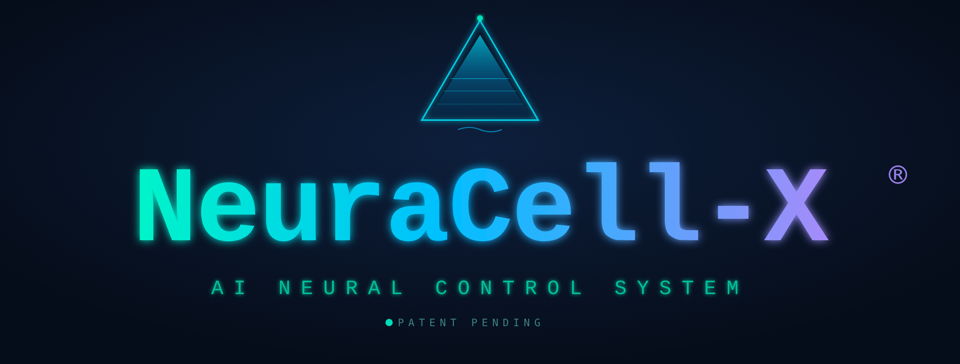

# Ambientika MQTT Bridge

**MQTT bridge for Ambientika ventilation units** – connects the Ambientika Cloud API to any local MQTT broker with full Home Assistant Auto-Discovery support.

> Works with: Home Assistant · Apple Home · Google Home · Amazon Alexa · Node-RED · Loxone · ioBroker · Matter · openHAB · Homey · and any MQTT-capable platform

---

<p align="center">
  
</p>

<h3 align="center">Powered by NeuraCell-X&reg; &mdash; the patent-pending AI Neural Control System</h3>

<p align="center">
  <b>Active radon protection</b> &nbsp;&middot;&nbsp; <b>Intelligent dew-point ventilation</b> &nbsp;&middot;&nbsp; <b>Whole-home, fully automatic</b>
</p>

<p align="center">
  
  
  
  
</p>

> **When radon rises**, every unit shifts to a gentle fresh-air overpressure (Zuluft, Stufe 1) that slows radon ingress. **When the outside air is too humid to ventilate**, the units pause so no moisture is drawn in. **When conditions are safe again**, normal operation is restored &mdash; automatically, with radon protection always taking priority.

---

## Supported Platforms

| Platform | Integration | Folder | Status |
|----------|-------------|--------|--------|
| **Home Assistant** | MQTT Auto-Discovery + Add-on | `ha-addon/` | ✅ Ready |
| **Apple Home** | Homebridge plugin | `homebridge-plugin/` | ✅ Ready |
| **Apple Home (native)** | Matter Bridge | `matter-bridge/` | ✅ Ready |
| **Google Home** | Homebridge plugin / Matter | `homebridge-plugin/` · `matter-bridge/` | ✅ Ready |
| **Amazon Alexa** | Homebridge plugin / Matter | `homebridge-plugin/` · `matter-bridge/` | ✅ Ready |
| **Node-RED** | Example flow | `examples/node-red/` | ✅ Ready |
| **Loxone** | MQTT Virtual I/O guide | `examples/loxone/` | ✅ Ready |
| **ioBroker** | Native adapter | `iobroker-adapter/` | ✅ Ready |
| **SmartThings** | Matter Bridge | `matter-bridge/` | ✅ Ready |
| **NeuraCell-X®** | Radon + dew-point protection (all platforms) | *built-in* | ✅ Ready |
| **openHAB** | MQTT Binding (generic) | See README | 📖 Guide |
| **KNX / BACnet** | Via MQTT-KNX gateway | See README | 📖 Guide |

---

## Quick Start

```bash
git clone https://github.com/ambientika-eu/ambientika-mqtt-bridge.git
cd ambientika-mqtt-bridge
cp .env.example .env
# Edit .env with your Ambientika credentials and MQTT broker settings
docker compose up -d
```

---

## Architecture
```
Ambientika Device (WiFi)
       |  (HTTPS/WebSocket)
  [Ambientika MQTT Bridge]  ← this project
       |  (MQTT)
  [MQTT Broker]
       |
   ┌───┴────────────────────────────────────┐
   │                                         │
   ▼                                         ▼
[Home Assistant]                    [Matter Bridge]
[Node-RED]                          [Apple Home]
[ioBroker]                          [Google Home]
[Loxone]                            [Amazon Alexa]
[openHAB]                           [SmartThings]
[Homebridge → Apple/Google/Alexa]
```

---

## NeuraCell-X&reg; &mdash; patent-pending radon & dew-point protection


**NeuraCell-X&reg;** is the AI Neural Control System built into the bridge. It couples the
Ambientika radon meter and dew-point control (Taupunktsteuerung) with your ventilation units:

- **Radon protection (highest priority):** radon alarm &rarr; all units to Intake (Zuluft / supply air) at fan **Stufe 1** &mdash; a gentle fresh-air overpressure that actively slows radon ingress.
- **Dew-point control:** ventilating would raise indoor humidity &rarr; units switch **off**; conditions favourable again &rarr; ventilation released.
- **Exact restore:** when all protections clear, every unit returns to the exact mode it had before.
- **Radon first, dew point scoped:** radon protection always covers every unit and overrides the dew-point block. When radon clears while the dew-point block (e.g. limited to the basement units via `dewpoint_block_devices`) is still active, all other units return to their own mode right away. A radon value (`radon_topic`) and an explicit alarm (`radon_alarm_topic`) are combined: either one keeps radon protection on.
- **Robust restore:** the pre-protection modes are saved to `/data/ambientika_neuracell_state.json`, so an add-on restart or update during active protection still returns every unit to its previous mode (a unit that was changed by hand in the meantime keeps that change). Manual commands sent while a unit is protected or offline are applied once protection ends. Set `radon_alarm_topic: none` if you only use the radon value and want the alarm topic ignored.
- **Ambientika radon meter built in:** a radon meter in MQTT mode 4 publishes `{"mittelwert": …}` on `radon/<meter-id>/state`; the bridge reads it directly (`radon_meter_topic`, default `radon/+/state`) — no Home Assistant automation needed. Its start-up value 0 is ignored, and when the meter goes offline its last value stops counting. With several radon sources (e.g. a second meter on `radon_topic`) the highest current value decides. Radon and dew-point topics accept plain values or JSON (`radon_value_key`, `dewpoint_block_key`) and MQTT wildcards.
- **Ambientika Taupunktsteuerung built in:** the dew-point controller with MQTT firmware publishes its decision as `{"ventilating": true|false, "reason": …}` on `dew-point/<id>/state`; the bridge reads it directly (`dewpoint_controller_topic`, default `dew-point/+/state`, key `dewpoint_controller_key`) — `ventilating: false` blocks the units in `dewpoint_block_devices`, no forwarding to `dewpoint_block_topic` needed (that topic still works for third-party sources, the last message wins; leave it at its default — if it also covers `dew-point/<id>/state`, those messages are read as a block signal instead and the log says so). Its Last Will on `dew-point/<id>/availability/state` and its sensor messages on `dew-point/<id>/sensors` are watched automatically.
- **Radon meter watched:** the meter's Last Will marks it offline at once; a meter that sends nothing (value or availability) for longer than `radon_meter_timeout` (default 30 min, 0 = off) counts as disconnected as well. The meters seen so far are remembered in a retained message (`<prefix>/neuracell/meters`; a meter not heard from for 7 days is no longer watched), so a bridge restart while the meter is already gone still ends in *Radon Meter Connected: off* once the limit runs out — the meter's own `online` is not retained and would otherwise never be missed. A live value counts as a sign of life; a value or `online` the broker delivers from its store (retained, e.g. after a restart) does not, the meter then has to send something within the limit, and a stored value of a meter that counts as lost is not used. The limit pauses while the bridge itself has no broker connection and starts afresh after a reconnect, so a broker outage never marks a meter as disconnected. Each meter is judged on its own and logged on every change; *Radon Meter Connected* is off as soon as one meter is lost.
- **Dew-point controller watched:** a Taupunktsteuerung that hangs stops sending, and its last block would otherwise stay in force unnoticed. The bridge watches it through its availability topic with Last Will (for the Ambientika controller automatically, otherwise `dewpoint_availability_topic`) (payload `online`/`offline`, `true`/`false` or JSON with `state`) or, for controllers without Last Will, a time limit without any message (`dewpoint_signal_timeout`, minutes; not applied while the Last Will reports online); a retained `online` delivered after a restart or reconnect is not taken as alive (and never revives a controller whose Last Will said offline), a live message on the controller's own topics (`dew-point/<id>/state`, `/sensors`) always is; with `dewpoint_source: device` failed cloud reads count like for the units. `dewpoint_lost_action` decides what happens then: `keep` (default, last state stays), `release` (ventilate) or `block` (units off). Radon keeps priority either way. While the controller counts as lost with `release`/`block`, a block value the broker delivers from its store (retained, e.g. after a bridge restart or reconnect) is not applied; once the controller is back (`online` on its availability topic, or a fresh message in time-limit mode) its last block value counts again. A live message is always applied. The time limit pauses while the bridge itself has no broker connection and restarts after a reconnect, so a broker outage never triggers the lost action. Use the controller's exact availability topic, not a wildcard that also matches the block topic.

The live status is published to `ambientika/neuracell/state` and surfaced natively on every platform (in Home Assistant the NeuraCell-X entities follow the bridge's own availability, so they show *unavailable* while the add-on is stopped instead of a stale value):

| Platform | NeuraCell-X&reg; surface |
|---|---|
| **Home Assistant** | Auto-discovered *Radon Protection Active*, *Radon Level*, *Radon Meter Connected*, *Ventilation Blocked (Dew Point)*, *Dew Point Controller Connected*, *Dew Point Indoor / Outdoor* |
| **ioBroker** | `ambientika.0.neuracell.*` states |
| **Apple / Google / Alexa** (Homebridge) | *NeuraCell-X* accessory: Radon Protection + Dew-Point Block occupancy sensors |
| **Matter** (SmartThings, ...) | *NeuraCell-X Radon Protection* contact sensor |
| **Node-RED / Loxone** | `ambientika/neuracell/state` inputs (see the examples) |

Both protections can read their trigger **hardware-free, straight from the Ambientika cloud** &mdash; no
extra sensor wiring, relay or MQTT signal needed. Set `radon_source: "device"` (radon meter) and/or
`dewpoint_source: "device"` (TPS) and give the device's serial number (it appears in the add-on log).

Configure it in the add-on options / `config.yaml`: `radon_source` (`signal` or `device`),
`radon_device_serial`, `radon_device_alarm_field` / `radon_device_alarm_values`, `radon_threshold`,
`radon_protection_fan`, `dewpoint_source` (`signal`, `computed` or `device`), `dewpoint_margin`, and more.

*NeuraCell-X&reg; and PhaseCell-X&reg; are registered trademarks of S&uuml;dwind / Ambientika. Patent pending.*

---

## Integration Guides

### Home Assistant Add-on
See [`ha-addon/README.md`](ha-addon/README.md)

### Apple Home + Google Home + Alexa (Homebridge)
See [`homebridge-plugin/README.md`](homebridge-plugin/README.md)

### Apple Home + Google Home + Alexa + SmartThings (Matter – native, no bridge app needed)
See [`matter-bridge/README.md`](matter-bridge/README.md)

### Home Assistant: ready-made package (evening/night programme, radon priority)
See [`examples/home-assistant-schlafetage/README.md`](examples/home-assistant-schlafetage/README.md)

### Node-RED
See [`examples/node-red/README.md`](examples/node-red/README.md)

### Loxone
See [`examples/loxone/README.md`](examples/loxone/README.md)

### ioBroker
See [`iobroker-adapter/README.md`](iobroker-adapter/README.md)

---

## MQTT Topics

| Topic | Direction | Description |
|-------|-----------|-------------|
| `ambientika/<serial>/state` | Bridge → Broker | Full device state (JSON, retained) |
| `ambientika/<serial>/availability` | Bridge → Broker | `online` / `offline` |
| `ambientika/<serial>/reset_state` | Bridge → Broker | Filter reset: `idle` / `running` / `confirmed` / `acknowledged` / `unconfirmed` |
| `ambientika/<serial>/set/<attribute>` | Broker → Bridge | Set **one** attribute, plain value |
| `ambientika/<serial>/set` | Broker → Bridge | Set **several** attributes at once (JSON object) |
| `ambientika/bridge/availability` | Bridge → Broker | The bridge itself: `online` / `offline` |
| `ambientika/neuracell/state` | Bridge → Broker | NeuraCell-X® radon + dew-point status (JSON) |
| `ambientika/neuracell/meters` | Bridge → Broker | Ambientika radon meters seen so far (JSON, retained; survives a bridge restart) |
| `radon/<id>/state`, `radon/<id>/availability/state` | Meter → Broker | Ambientika radon meter (MQTT mode 4): `{"mittelwert": …}`, Last Will |
| `dew-point/<id>/state`, `dew-point/<id>/sensors`, `dew-point/<id>/availability/state` | Controller → Broker | Ambientika Taupunktsteuerung: `{"ventilating": …, "reason": …}`, sensor values, Last Will |

`<serial>` is the device serial number as reported by the cloud; it is printed in
the log at start-up. `ambientika` is the default prefix (`MQTT_PREFIX`).

### Status Payload Example

```json
{
  "operating_mode": "Smart",
  "operating_mode_raw": "Surveillance",
  "fan_speed": "Medium",
  "humidity_level": "Normal",
  "light_sensor_level": "Medium",
  "temperature": 21,
  "humidity": 52,
  "air_quality": "Good",
  "humidity_alarm": false,
  "filters_status": "Good",
  "filters_status_raw": "Good",
  "night_alarm": false,
  "device_role": "SlaveEqualMaster",
  "last_operating_mode": "Smart",
  "zone_index": 1,
  "operating_mode_num": 0,
  "operating_mode_raw_num": 5,
  "last_operating_mode_num": 0,
  "fan_speed_num": 2,
  "humidity_level_num": 1,
  "light_sensor_level_num": 3,
  "air_quality_num": 3,
  "filter_status_num": 0,
  "filter_status_raw_num": 0
}
```

Every categorical value comes with a numeric companion (`*_num`) so long-term
statistics and Grafana work without a translation table of your own.

### Commands

Writable attributes and their accepted values:

| Attribute | Values |
|---|---|
| `operating_mode` | `Smart`, `Auto`, `ManualHeatRecovery`, `Night`, `AwayHome`, `Surveillance`, `TimedExpulsion`, `Expulsion`, `Intake`, `MasterSlaveFlow`, `SlaveMasterFlow`, `Off` |
| `fan_speed` | `Low`, `Medium`, `High` |
| `humidity_level` | `Dry`, `Normal`, `Moist` |
| `light_sensor_level` | `NotAvailable`, `Off`, `Low`, `Medium` |
| `reset_filter` | any payload triggers the filter reset |

**One attribute** — the value is the plain payload, not JSON:

```
topic:   ambientika/AMB-2024-001/set/operating_mode
payload: MasterSlaveFlow
```

**Several attributes at once** — a JSON object on the `set` topic, without an
attribute in the topic:

```
topic:   ambientika/AMB-2024-001/set
payload: {"operating_mode": "MasterSlaveFlow", "fan_speed": "High"}
```

The short names `mode`, `fanSpeed`, `humidityLevel` and `lightSensorLevel` are
accepted as well. An invalid value rejects the whole command; an unknown key is
skipped with a warning in the log.

**Commands are coalesced.** Each command has to fill the attributes it does not
set from the device's current status, and the cloud needs a moment to reflect a
change. Commands that arrive for the same device within `COMMAND_COALESCE_MS`
(default `800`) are therefore applied in a single call — so an automation that
sets the operating mode and then the fan speed no longer writes the old mode
back. Set `COMMAND_COALESCE_MS=0` to apply every command on its own, immediately.

> `fan_speed` may be *reported* as `Night` while a unit runs on its night step.
> That value is read-only: it is published as state but rejected on the command
> path, because the API would not accept it back.

---

## Environment Variables

| Variable | Default | Description |
|----------|---------|-------------|
| `AMBIENTIKA_EMAIL` | — | Ambientika account email |
| `AMBIENTIKA_PASSWORD` | — | Ambientika account password |
| `MQTT_BROKER` | `localhost` | MQTT broker host |
| `MQTT_PORT` | `1883` | MQTT broker port |
| `MQTT_USER` | *(empty)* | MQTT username (**required** for most brokers) |
| `MQTT_PASSWORD` | *(empty)* | MQTT password (**required** for most brokers) |
| `MQTT_PREFIX` | `ambientika` | MQTT topic prefix |
| `POLL_INTERVAL` | `30` | Device poll interval in seconds |
| `AVAILABILITY_FAILURE_THRESHOLD` | `3` | Consecutive failed polls before a device is flagged offline |
| `HA_DISCOVERY` | `true` | Enable Home Assistant Auto-Discovery |
| `LOG_LEVEL` | `INFO` | Logging level |
| `COMMAND_COALESCE_MS` | `800` | Commands for the same device within this window are applied in one call (`0` = off) |
| `SLAVE_FILTER_SOFT_RESET` | `0` | Record a bridge-side "serviced" acknowledgement when a Slave's filter counter cannot be cleared remotely (see below) |
| `FILTER_ACK_TTL_DAYS` | `90` | How long such an acknowledgement stays valid |
| `FILTER_ACK_PATH` | `/data/filter_ack.json` | Where the acknowledgements are stored (needs a persistent volume) |

> **MQTT credentials are required for most brokers.** The official Home Assistant Mosquitto add-on and most production setups disable anonymous MQTT access. If `MQTT_USER` / `MQTT_PASSWORD` are empty the bridge will fail to connect with `Not authorized`. Create a dedicated MQTT user for the bridge (e.g. via the Mosquitto add-on's `logins` option) and set both variables.

---

## Notes

### Unknown enum values from the cloud API

The cloud API occasionally reports enum values that the pinned `ambientika_py`
release does not know. `ambientika_py` resolves them with plain `Enum[...]`
lookups, so an unknown value raises `KeyError` *inside* `Device.status()` and
aborts the whole poll for that device. The known case is `"fanSpeed": "Night"`,
reported while a unit runs in night mode (see
[#5](https://github.com/ambientika-eu/ambientika-mqtt-bridge/issues/5)):

```
ERROR  Error polling <serial>: 'Night'
```

The bridge registers `FanSpeed.Night` and `FanSpeed.Turbo` at start-up (the API
schema at `https://app.ambientika.eu:4521/swagger/v1/swagger.json` defines
`FanSpeed` as Low, Medium, High, Night, Turbo) and installs a tolerant enum
lookup, so any future unknown value is auto-registered with a warning instead of
breaking the poll. Such compatibility members are **read-only**: they are
published as state but never sent to the API, which would not accept them back.
A command that names one (a Home Assistant scene restoring a snapshotted
`Turbo`, say) is carried out with the nearest sendable value instead, see below;
a name the enum does not know at all is still rejected.

A command that does not name every attribute (e.g. a mode change from the
Home Assistant `select`) fills the missing ones from the current cloud status.
Since 1.4.29 a read-only value found there is never echoed back: the bridge sends
the last value of that attribute the cloud accepted for this unit (seen in a poll
or sent by a command), or - if it never saw one - the nearest sendable value
(Night → Low, Turbo → High, unknown humidity → Normal, unknown dusk level → Off),
and logs what it replaced. An unknown *operating mode* is never guessed; such a
command is skipped with an error. Before 1.4.29 an auto-registered value (internal
number 900+) went straight into `change_mode` and the cloud answered
`HTTP 500 "Value was either too large or too small for an unsigned byte"`.

### Filter reset on Master/Slave groups

The filter reset is applied by the **Master** of a coupled zone. Each Slave keeps
its own counter, which the cloud cannot reach: a reset addressed to a Slave is
acknowledged with HTTP 200 but never carried out. The bridge sends the documented
`device/reset-filter` to the device and to its zone Master, then checks the real
device status and reports what actually happened - for a Slave it says plainly
that the reset has to be done at the unit itself, instead of promising a change on
a later poll.

A counter is only skipped when it is positively `Good`. `Medium` (yellow) is a
real reset case, since filters are usually cleaned before the alarm turns red.

Set `SLAVE_FILTER_SOFT_RESET=1` and mount a persistent `/data` to record a
bridge-side maintenance acknowledgement for such a Slave. `filter_status_num` then
reports the serviced unit as green until `FILTER_ACK_TTL_DAYS` expire, while the
raw device value stays untouched. Both the text and the numeric field come as a
pair - the main field carries the effective value, the raw device value sits next
to it:

| Field | Content |
|---|---|
| `filters_status` | effective (acknowledgement applied) |
| `filters_status_raw` | raw device value |
| `filter_status_num` | effective |
| `filter_status_raw_num` | raw device value |

Warning rules on the worst filter state therefore fire correctly again, without a
serviced Slave hanging on red forever. With the feature off - the default - the
main and raw fields are identical.

The diagnostic sensor *Filter Reset Status* reports `acknowledged` for such a
reset, as opposed to `confirmed` (the counter really cleared) and `unconfirmed`
(neither cleared nor recorded). Since 1.4.32 the acknowledged value is published at
once, not with the next poll, and an acknowledgement that cannot be stored (no
writable `/data`) is reported as a warning and `unconfirmed` instead of
`acknowledged`.

Since 1.4.30 an acknowledgement ends only when `FILTER_ACK_TTL_DAYS` run out or
when the device itself reports `Good` for at least 10 polls in a row spanning at
least 10 minutes (filter reset at the unit; a rebooting unit or a short cloud
hiccup reporting a default `Good` does not count); both are logged
(`filter acknowledgement for <serial> removed: ...`). A poll with an unrecognised
raw value keeps the acknowledgement and is logged once per new value. Before
1.4.30 a single poll with a raw value that was `Good` or unrecognised removed it
at once and without a log line.

### Mode changes: accepted is not applied

`device/change-mode` returns HTTP 200 once the cloud has accepted the call; it
does not report whether the unit carried it out. Since 1.4.30 the log line reads
`change_mode OK for <serial> (accepted by the cloud)` and the bridge checks the
following polls: `operating mode <mode> confirmed on <serial>` once the unit
reports the sent mode, or a warning if it still reports another mode after
`MODE_VERIFY_WINDOW_S` (180 s). A unit under NeuraCell-X protection is not judged,
and the check never costs a poll - if it ever failed internally the status would
still be published.
For a Slave the warning names the zone Master: a coupled Slave runs with its
Master, so the mode belongs on the Master.

Truly zeroing a Slave's counter is only possible at the device: configure the unit
in the app temporarily as a standalone device, reset the filter, then set it up as
a Slave again.

### Operating mode of a Slave

A coupled Slave runs with its zone Master. Its own mode field is not what it is
doing - a Slave can report `Surveillance` and still ventilate in the Master's
reversing rhythm. Like the Ambientika app, which shows only the Master's status for
a zone, the bridge since 1.4.32 publishes the Master's mode for a Slave and keeps
the Slave's own value next to it:

| Field | Content |
|---|---|
| `operating_mode` / `operating_mode_num` | effective mode (the zone Master's for a Slave) |
| `operating_mode_raw` / `operating_mode_raw_num` | the unit's own value |

Masters are read first in each cycle. The unit's own value is shown instead while
NeuraCell-X protection controls the unit, or if its Master has not been read for
more than `max(300 s, 2 x POLL_INTERVAL + 60 s)`. The zone Master is looked up
within the same house, and the roles come from what each unit reports in its own
status (`device_role`: `Master`, `SlaveEqualMaster`, `SlaveOppositeMaster`,
`NotConfigured`), so re-coupling or resetting units in the app is followed
without a restart; a reset unit that still carries its old zone index is not a
Slave. When a Slave's own value differs, the log says so once per change
(`operating mode of <serial>: the unit reports ..., shown as ...`). Selecting a
mode on a Slave still sends the command to that unit; the published mode follows
the Master, so set modes on the Master.

### Plausibility of temperature and humidity

Values outside the sensor range are never published (humidity 1-100 %,
temperature -40 to 85 °C). A single impossible drop such as 6 % humidity between
55 and 70 % is held back too: a humidity below 20 % is published only if dry air
(below 25 %) was already measured among the last three readings (a held-back one
counts) or published within the last hour (at least six poll intervals).
Genuinely dry winter air is therefore confirmed by its own next dry reading - only
the first dry reading after a long humid stretch is delayed by one reading - while
rises, shower peaks and the normal reversing rhythm are never held back. The cloud
hands out the unit's last status packet, so with a poll interval shorter than the
unit's upload rhythm the same packet is read several times; a repeat within
`DUPLICATE_PACKET_MAX_S` (120 s) does not count as a new reading and cannot
confirm a held-back value. Meanwhile the last
plausible value is published, for at most ten minutes; after that the value is
published as unknown, so a failed sensor never looks live. The log notes once when
values are held back and once when a plausible value returns, at most once an hour
for a flapping sensor.

### Availability debounce

A single failed poll is usually a transient cloud hiccup - the API sporadically
answers `HTTP 404 Status packet not found!` for a device that is perfectly
reachable. The bridge therefore only publishes `offline` after
`AVAILABILITY_FAILURE_THRESHOLD` consecutive failures (default `3`), which stops
entities from flickering to *unavailable* and back for one poll interval. Set it
to `1` for the previous immediate-offline behaviour.

### `ambientika_py` dependency

The bridge installs [`ambientika_py`](https://github.com/wingertge/ambientika-py) from PyPI (`ambientika_py>=0.0.6`). Release 0.0.6 contains the `LightSensorLevel` enum the bridge requires; the earlier 0.0.5 did not, so previous builds pinned the library to an upstream Git commit as a temporary workaround (see [#3](https://github.com/ambientika-eu/ambientika-mqtt-bridge/issues/3) and [wingertge/ambientika-py#8](https://github.com/wingertge/ambientika-py/issues/8)). That is no longer necessary.

---

## License

MIT License – © Ambientika / SUEDWIND

---

## Links

- 🌐 [ambientika.eu](https://www.ambientika.eu)
- 📦 [GitHub Repository](https://github.com/ambientika-eu/ambientika-mqtt-bridge)

---

## Running without our server

This bridge reads its data through the Ambientika server. There is a second, standalone version that replaces that server with a local service speaking the same protocol, so no measurement and no command leaves the house:

https://github.com/ambientika-eu/ambientika-local-standalone

Initial commissioning still runs once through the Ambientika app; after that the installation stays local. The standalone version is new and not yet proven on every firmware revision, so it ships in observation mode: it reads, decodes and publishes, but writes nothing to the units until you switch that off.
